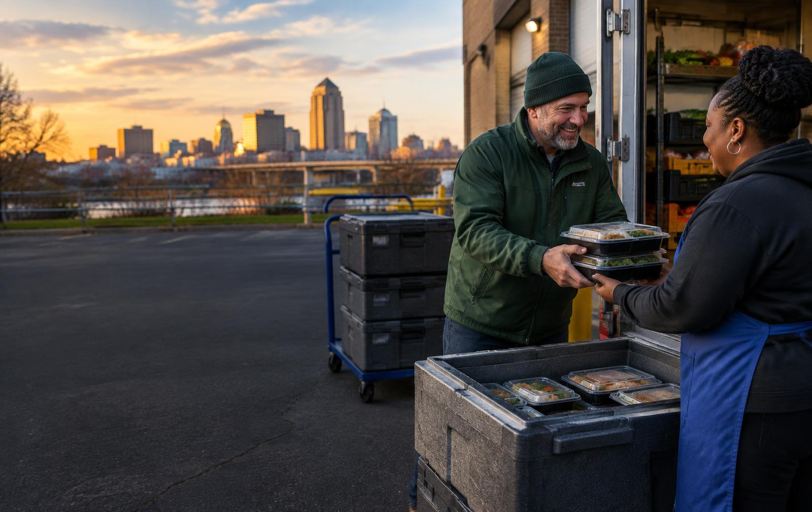
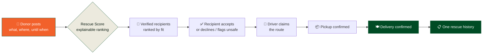

<div align="center">



# RescueRelay

### From surplus to supper — before it spoils.

**A coordinator-led dispatch network for urgent food rescue.**
Safe surplus reaches the right verified nonprofit and volunteer driver in minutes, and every handoff leaves a record.

[](https://rohit-ats.github.io/Rescue-Relay/)
[](https://github.com/Rohit-ATS/Rescue-Relay/actions/workflows/deploy.yml)
[](#verification)
[](LICENSE)

`React 19` · `TanStack Start` · `Supabase` · `Tailwind CSS v4` · `TypeScript`

**[Try the live workspace](https://rohit-ats.github.io/Rescue-Relay/dashboard)** — no sign-up, no API keys, real data flowing between tabs.

</div>

---

## The problem

Good food goes to landfill while pantries go empty, and the reason is almost never generosity. It is logistics. A restaurant with 150 lb of safe prepared meals has about four hours and a phone, and no idea which nonprofit three miles away has refrigeration free tonight.

RescueRelay replaces the calling-around with one accountable relay.



| | |
| :-- | :-- |
| ⏱️ **Urgency first** | Ranked by time remaining, not by who called first |
| 🛡️ **Verified** | Only qualified recipient partners are matched |
| 📍 **Capacity-aware** | Storage, distance, and real community need |
| 📋 **Documented** | Every handoff recorded, start to finish |

---

## Quick start

```bash
git clone https://github.com/Rohit-ATS/Rescue-Relay.git
cd Rescue-Relay
npm install --prefix frontend
npm run dev
```

Open the printed URL and click **Explore live demo**. That is the whole setup — **the app runs with no API keys at all.** Everything in [Configuration](#configuration) is optional hardening.

> Requires Node 22 (the version CI builds on).

| Command | What it does |
| :-- | :-- |
| `npm run dev` | Dev server with HMR and realtime sync |
| `npm run test` | 256 unit and integration tests |
| `npm run build` | Production bundle |
| `npm run build:pages` | Prerendered static bundle for GitHub Pages |
| `npm run preview` | Preview the production build locally |
| `npm run lint` | ESLint (see the note under [Verification](#verification)) |

---

## How a rescue moves

**01 · Post** — a donor shares what is ready, where, and until when. The pickup address is geocoded so the offer can be scored against real distances.

**02 · Match** — eligible recipients are ranked by an explainable **Rescue Score**. Never a black box: every score ships with the sentence behind it, such as *"2.4 miles away · storage ready · serves 310 households · accepts this food."*

| Signal | Weight | What it measures |
| :-- | --: | :-- |
| Urgency | 35% | Minutes left in the pickup window |
| Fit | 25% | Cold chain, category, and capacity — pass/fail, not partial credit |
| Distance | 20% | Road distance to the recipient |
| Community need | 10% | Households the recipient serves |
| Volunteer load | 10% | Whether one driver can realistically carry it |

A recipient that cannot store the food, cannot take the category, or has no room is **ineligible outright** — it never places on the list regardless of the other four signals.

**03 · Deliver** — a driver claims the route and records pickup, safe transport, and delivery. The dashboard draws the road route and the turn-by-turn directions; distance, drive time, and the "Open in Google Maps / Apple Maps" hand-offs work with no key at all, so a driver can always start navigating.

---

## The network

Four roles, one shared purpose — each sees the same records from their own angle.

| Role | In the workspace |
| :-- | :-- |
| 🏪 **Food donors** | Grocers, restaurants, and kitchens post safe surplus ready for pickup |
| 🤝 **Nonprofit recipients** | Accept food that fits their storage and capacity, or decline and flag unsafe |
| 🚗 **Volunteer drivers** | Claim nearby runs and record each handoff |
| 🛡️ **Coordinators** | Verify partners, oversee matches, and resolve exceptions |

---

## What's inside

<table>
<tr><td width="50%" valign="top">

### 🗺️ Live dispatch map
Pickups, partners, and public food banks on one map, with road routing and turn-by-turn directions. Falls back to keyless OSRM routing when Google Directions is unavailable, so a driver is never left without a route.

</td><td width="50%" valign="top">

### ⚡ Realtime workspace
One Supabase Realtime channel watches all seven operational tables. Every view derives from a single query, so nothing drifts out of sync. The status indicator reports the real socket state — it never reads "Live" over a dead connection.

</td></tr>
<tr><td width="50%" valign="top">

### 🧭 Explainable matching
The Rescue Score is a pure, tested function. Coordinators and recipients stay in the decision; the ranking argues its case and can be audited.

</td><td width="50%" valign="top">

### 🔐 Locked workflow boundaries
Rescue transitions run inside locked database functions with direct browser writes revoked, so concurrent or forged client requests cannot bypass authorization.

</td></tr>
<tr><td width="50%" valign="top">

### 📍 Keyless by default
Geocoding falls through a four-provider chain ending at public, keyless services. A missing credential degrades one feature; it never blocks a rescue.

</td><td width="50%" valign="top">

### 🤖 AI broadcast workflows
Optional agents draft and schedule community posts across LinkedIn, Instagram, and X when surplus needs reaching further than the partner list.

</td></tr>
</table>

---

## Safety before speed

Food rescue only works when partners can trust the handoff. RescueRelay **supports** an organization's food-safety policy; it does not replace it.

- **Check the essentials** — allergens, handling notes, required storage, and the pickup deadline are recorded before posting.
- **Match for real capacity** — only compatible recipients are ranked, and every score includes its reason.
- **Keep the right to say no** — recipients can decline or flag unsafe food; drivers acknowledge safe handling before completing pickup.
- **Leave an accountable record** — donation, acceptance, assignment, pickup, and delivery connect into one rescue history.

---

## Architecture

```text
Rescue-Relay/
├── frontend/                   # Full-stack app — TanStack Start, React 19, Tailwind v4
│   ├── src/
│   │   ├── routes/             # File-based routes: landing, auth, onboarding,
│   │   │                       #   dashboard, memberships, workflows
│   │   ├── components/
│   │   │   └── rescuerelay/    # Design system, live map, workspace cards
│   │   ├── lib/                # Scoring, matching, realtime sync, geocoding,
│   │   │                       #   routing, server functions
│   │   ├── integrations/       # Supabase client and auth middleware
│   │   └── test/               # 30 suites: lib logic, components, routes
│   ├── drizzle/migrations/     # Versioned SQL — RLS policies and workflow locks
│   └── supabase/seed-demo.sql  # A full network to click through
└── .github/workflows/          # Prerender and deploy to GitHub Pages
```

| Layer | Choice | Why |
| :-- | :-- | :-- |
| Framework | TanStack Start + React 19 | File-based routes with real server functions |
| Data | Supabase (Postgres, RLS, Realtime) | Row-level security and live updates without a bespoke backend |
| Schema | Drizzle ORM + versioned SQL | Every policy change is a reviewable migration |
| Styling | Tailwind CSS v4 | Design tokens shared by the app and the map |
| Validation | Zod | One schema for client and server |
| Testing | Vitest + Testing Library | 256 tests, logic and UI |

---

## Configuration

**The app runs with no API keys at all.** Everything here is optional.

<details>
<summary><b>Required once, in the Supabase dashboard</b> — new sign-ups cannot sign in until this is flipped</summary>

<br>

**Authentication → Sign In / Providers → uncheck "Confirm email".**

The project ships with `mailer_autoconfirm = false`. Until that box is unchecked, every sign-up returns `email_not_confirmed` on the next sign-in, and the confirmation mail goes through Supabase's built-in SMTP — owner address only, roughly two messages an hour. No new donor, nonprofit, or driver can reach the workspace until this is changed or a real SMTP provider is configured under **Authentication → Emails**.

Password reset and the resend-confirmation button on `/auth` depend on the same mail path.

</details>

<details>
<summary><b>Optional environment variables</b></summary>

<br>

| Variable | Effect when absent |
| :-- | :-- |
| `GOOGLE_MAPS_API_KEY` | Pickup geocoding falls back to the keyless providers below. For direct Google geocoding, enable **Geocoding API v4** and use a server key restricted to that API and the deployment's egress IPs where available. |
| `LOVABLE_API_KEY` | The Lovable connector gateway is skipped; set it together with `GOOGLE_MAPS_API_KEY` to route geocoding through Lovable. |
| `VITE_LOVABLE_CONNECTOR_GOOGLE_MAPS_BROWSER_KEY` | The dashboard map panel shows a configuration notice; all other views work. |

</details>

<details>
<summary><b>Geocoding — the four-provider chain</b></summary>

<br>

Posting a donation needs coordinates before it can be scored, so `createDonation` resolves the pickup address through [`src/lib/geocode.server.ts`](frontend/src/lib/geocode.server.ts):

1. **Lovable connector gateway** — when `LOVABLE_API_KEY` and `GOOGLE_MAPS_API_KEY` are both set.
2. **Google Geocoding v4 direct** — when `GOOGLE_MAPS_API_KEY` is set on its own; the key travels in `X-Goog-Api-Key`, never in the URL.
3. **US Census geocoder** — keyless, public domain, US addresses only.
4. **Nominatim (OpenStreetMap)** — keyless, global; identifying User-Agent, throttled to one request per 1.1s per the OSM usage policy.

Unconfigured providers are skipped rather than counted as failures, and a provider that errors hands off to the next, so a single outage never blocks a rescue. The chain separates the two failure modes a donor cares about: `AddressNotFoundError` when providers answered but nothing matched (fix the address) and `GeocoderUnavailableError` when every provider errored (retry shortly). The provider that placed the pin is recorded on the `donation_posted` event so coordinators can audit a bad location.

</details>

<details>
<summary><b>Realtime synchronization — the details that matter in the field</b></summary>

<br>

One shared Supabase Realtime channel per signed-in user watches all seven operational tables (`donations`, `matches`, `deliveries`, `organizations`, `rescue_events`, `profiles`, `user_roles`). Any saved change refetches the single `rescue-workspace` query every authenticated view derives from. See [`src/lib/live-sync.tsx`](frontend/src/lib/live-sync.tsx):

- **The token is re-applied on refresh.** Realtime authorizes RLS against the token passed to `realtime.setAuth`, and that token rotates about an hour after sign-in. Without re-applying it the subscription keeps reporting `SUBSCRIBED` while silently delivering nothing, so `TOKEN_REFRESHED` re-authorizes the socket.
- **Invalidation is keyed.** Only `rescue-workspace` is refetched, and row events are debounced 150 ms so one rescue action causes one refetch instead of a burst.
- **Reconnects back off with full jitter**, 1 s to 15 s, so a flapping socket cannot spin and many clients do not retry in lockstep after an outage.
- **Polling is the safety net, not the mechanism.** 60 s while the socket is healthy, 5 s while it is not.
- **The indicator tells the truth.** It reports the real channel state, the retry count, and how long since the last saved change.

</details>

<details>
<summary><b>Workspace views — how each list is derived</b></summary>

<br>

All four derive from the same RLS-scoped workspace query, as pure functions with their own tests.

**Activity** ([`rescue-activity.ts`](frontend/src/lib/rescue-activity.ts)) splits a user's involvements into *current* and *recent*. Signing up to drive puts a route under current; confirming delivery moves it to recent with the time it closed. One rescue yields one entry, labelled with the user's most hands-on role, and anything blocked on them floats to the top with a "Waiting on you" badge and the action inline.

**Opportunities** ([`rescue-opportunities.ts`](frontend/src/lib/rescue-opportunities.ts)) lists runs a volunteer can take, nearest first when they share a location. Each names the food bank it serves — capacity, cold chain, households served, categories accepted — and expands to a route map with distance, drive time, and turn-by-turn directions.

**Partners** is the full directory: every organization, donors and food banks alike, filterable by type and searchable by name, address, or food category. A card opens the full profile — phone, email, receiving hours, a map with directions, intake limits, and how many rescues it has handled. Coordinator verify/suspend controls are inline.

**Map** shows active pickups, partner food banks, and real public food banks sourced from OpenStreetMap — context on where food could go beyond the partners already signed up.

Location is optional throughout: without it the lists still render, ordered by deadline rather than distance.

</details>

<details>
<summary><b>Database migrations worth knowing about</b></summary>

<br>

- **0010** re-opens *verified* organizations of any type to all users, leaving pending and suspended ones visible only to coordinators. Without it, Partners and Opportunities show only organizations you are already involved with.
- **0011** adds the partner contact columns (phone, email, website, receiving hours). Without it those fields read "Not provided"; nothing else breaks.
- **0017** closes workflow write boundaries — apply it to **every** environment before deployment. It invalidates the old fixture credentials, removes direct browser writes to workflow tables, and tightens coordinator controls. It preserves existing coordinator rows to avoid disabling legitimate administrators, so review `public.user_roles` afterwards and remove any coordinator your team did not provision.

</details>

---

## Demo data

The deployed walkthrough uses a **browser-only demo workspace** — full network, live across tabs, nothing written to a database. Real accounts go through the normal authentication flow.

For a seeded Supabase environment, paste [`frontend/supabase/seed-demo.sql`](frontend/supabase/seed-demo.sql) into the SQL Editor and run it. It runs as `postgres`, needs no API keys, and is safe to re-run. It creates nine organizations (five verified food banks, one pending, one suspended, two verified donors) and ten rescues covering every stage — open, matched, accepted, driver-assigned, picked-up, delivered, and expired — plus a declined match, so the decline path has something to show.

Organization names are fictional, placed at real Des Moines street addresses so distances, sorting, and driving routes behave realistically. Deadlines are relative to when you run it, so the demo is always current. The fixture identities are non-interactive and deliberately share no sign-in password.

---

## Verification

```bash
npm run test     # 256 tests across 30 suites: scoring, schemas, routing,
                 # geocoding, backoff, activity lifecycle, opportunities,
                 # partner records, map rendering, distance and directions
npm run build    # production bundle + prerender of all 7 routes
npm run lint
```

> `npm run lint` currently reports pre-existing Prettier formatting diffs in the dense-style generated files. `npm run format` resolves them, at the cost of a repo-wide reformat that syncs back to Lovable.

---

## Deployment

Continuous deployment to GitHub Pages runs on every push to `main`.

1. **Settings → Pages → Build and deployment → Source**: select **GitHub Actions**.
2. Push to `main`, or run the **Deploy RescueRelay to GitHub Pages** workflow from the **Actions** tab.
3. The workflow prerenders every route and configures the SPA fallbacks (`404.html`, `.nojekyll`).

**Live:** [rohit-ats.github.io/Rescue-Relay](https://rohit-ats.github.io/Rescue-Relay/)

---

<div align="center">

### Good food deserves a next stop.

**Safe surplus. Local partners. One accountable relay.**

📍 Des Moines, Iowa · pilot network

[Explore the live workspace →](https://rohit-ats.github.io/Rescue-Relay/dashboard)

<sub>Meal estimates use 1.2 lb per meal and are not a guarantee of servings.<br>
Pilot figures shown on the site are illustrative; your dashboard shows saved records.</sub>

<br>

[MIT License](LICENSE) · © 2026 RescueRelay

</div>
